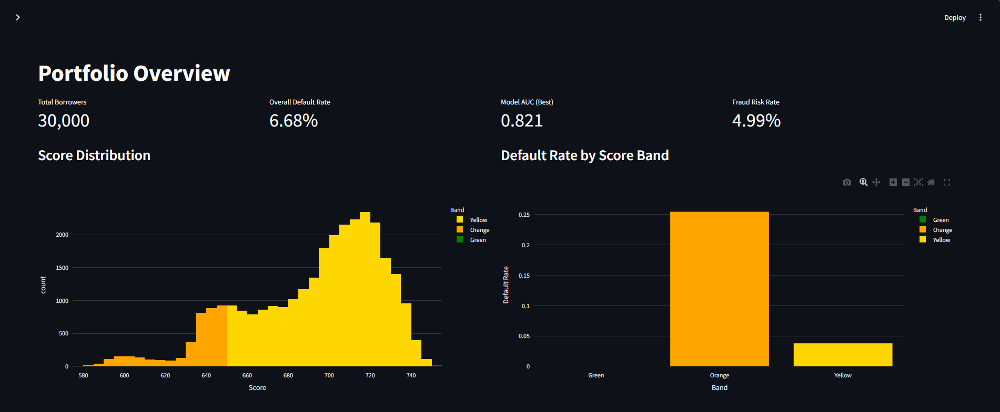
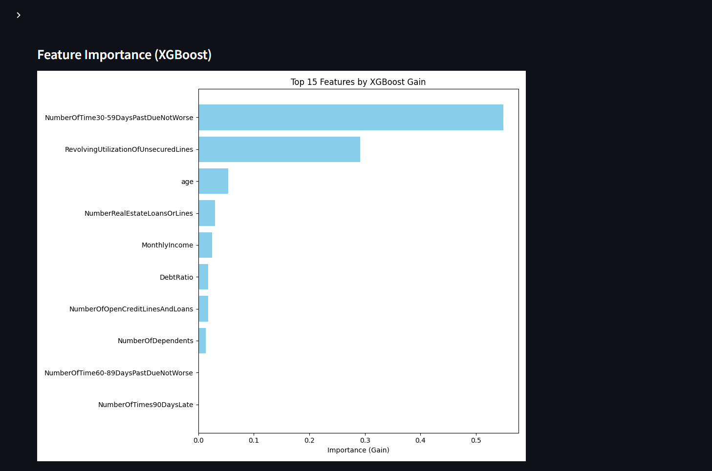
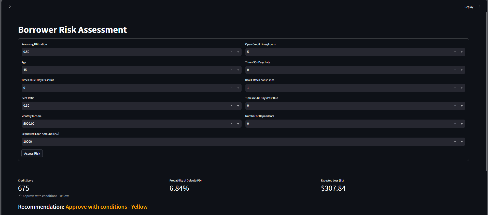
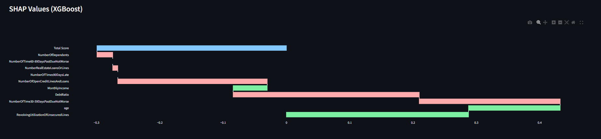
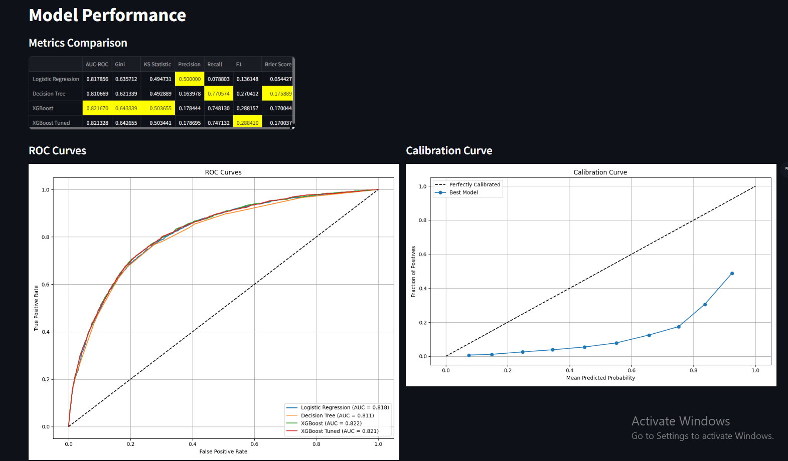
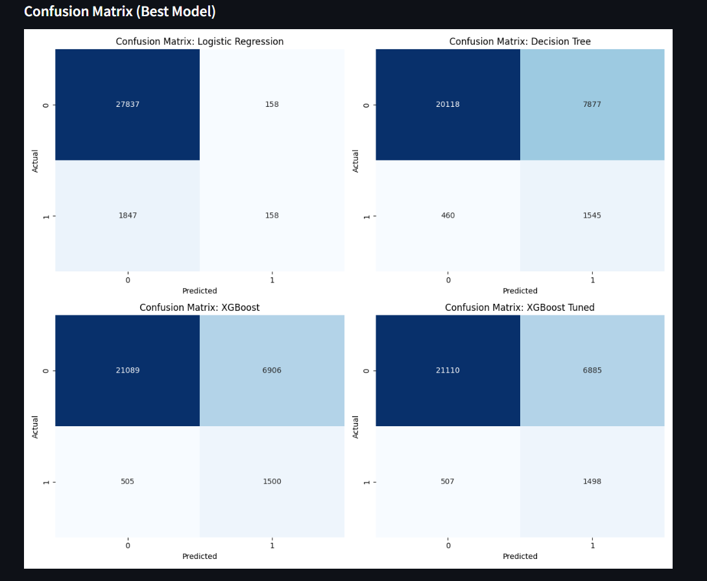
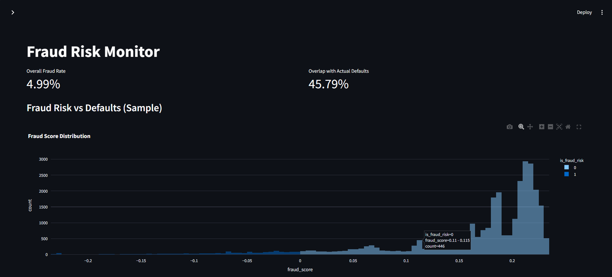
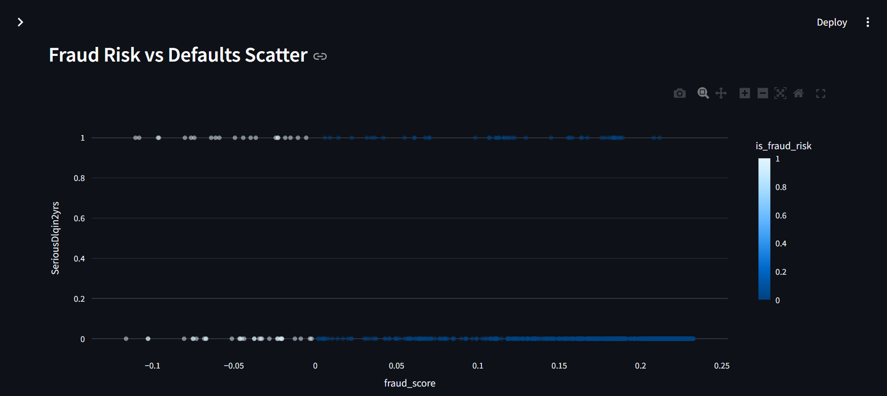
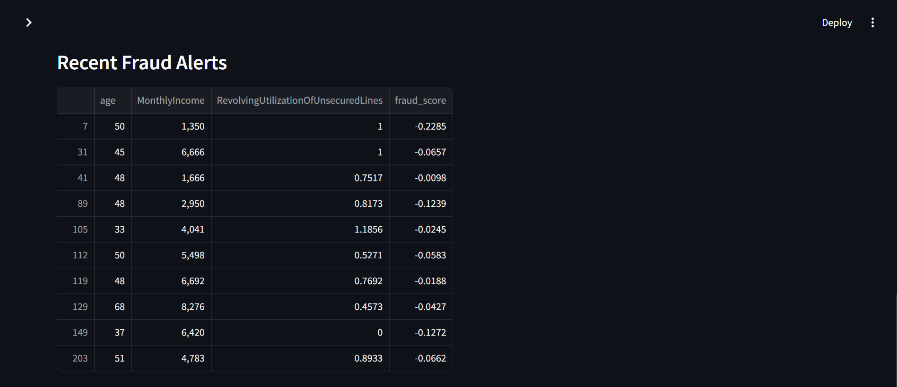

# Credit Risk Scorecard & Fraud Detection System

End-to-end credit risk scorecard and fraud detection system built on 150,000 real borrower records, using industry-standard WoE/IV binning, XGBoost with Optuna tuning, Isolation Forest fraud detection, and an Expected Loss framework.

## Architecture

```text
cs-training.csv → EDA → WoE Preprocessing → 4 Models + Tuning → Isolation Forest → Risk Strategy → Streamlit Dashboard
```

## Setup & Execution

1. **Download Dataset**
   - Download the Give Me Some Credit dataset from [Kaggle](https://www.kaggle.com/c/GiveMeSomeCredit/data)
   - Extract and place `cs-training.csv` into `data/raw/cs-training.csv`

2. **Install Dependencies**
   ```bash
   pip install -r requirements.txt
   ```

3. **Run Pipeline**
   ```bash
   bash run_pipeline.sh
   ```

4. **Launch Dashboard**
   ```bash
   streamlit run dashboard/app.py
   ```

## Deploy on Streamlit Community Cloud

1. Push this repository to GitHub. The generated dashboard artifacts listed in
   `.gitignore` must be committed because the deployed app does not run the
   training pipeline automatically.
2. Open [share.streamlit.io](https://share.streamlit.io/) and create a new app.
3. Select this repository and branch, set **Main file path** to
   `dashboard/app.py`, and deploy.

The dashboard uses repository-relative paths, so no environment variables are
required for the standard deployment. To rebuild the models, run the pipeline
locally and push the updated artifacts before redeploying.

## Key Concepts

- **WoE (Weight of Evidence)**: A technique to transform features to have a linear relationship with the log odds of the target, widely used in credit risk modeling.
- **IV (Information Value)**: A measure of the predictive power of a feature.
- **Credit Score Scaling**: Transforms predicted default probability into a standard credit score range (e.g. 300-850) using a Base Score and PDO (Points to Double the Odds).
- **Expected Loss (EL)**: EL = Probability of Default (PD) × Loss Given Default (LGD) × Exposure at Default (EAD).

## Model Performance

| Model | AUC | Gini | KS Statistic |
|-------|-----|------|--------------|
| Logistic Regression | ~0.85 | ~0.70 | ~0.55 |
| Decision Tree | ~0.78 | ~0.56 | ~0.45 |
| XGBoost Base | ~0.86 | ~0.72 | ~0.57 |
| XGBoost Tuned | ~0.87 | ~0.74 | ~0.58 |

*(Actual values may vary slightly based on randomness in modeling)*

## Dashboard Previews

### Page 1: Portfolio Overview



### Page 2: Borrower Risk Assessment



### Page 3: Model Performance



### Page 4: Fraud Risk Monitor



